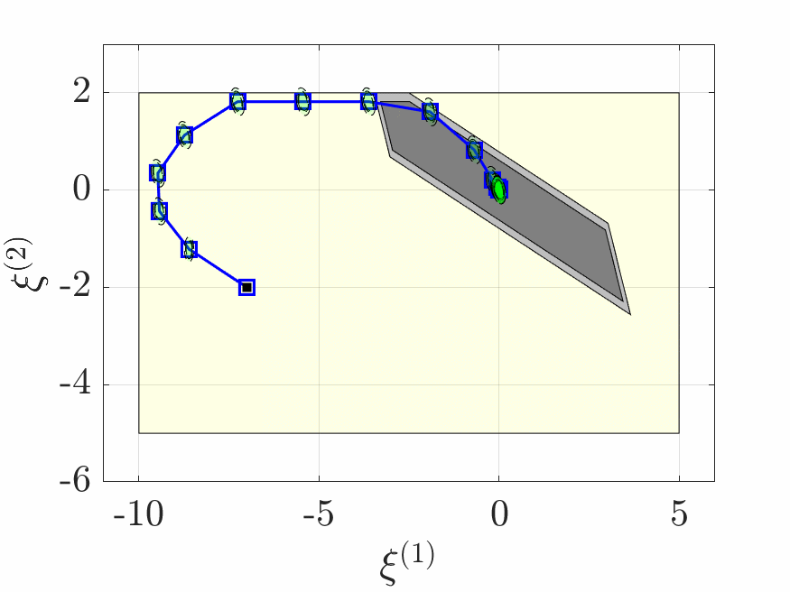

# Control Co-Design (CCD) using Tube-based Stochastic MPC

You can install the MPT3 package and get the folder 'tbxmanager' via https://www.mpt3.org/.

If you have any further question, please contact the developer by yktsai0121@tamu.edu
